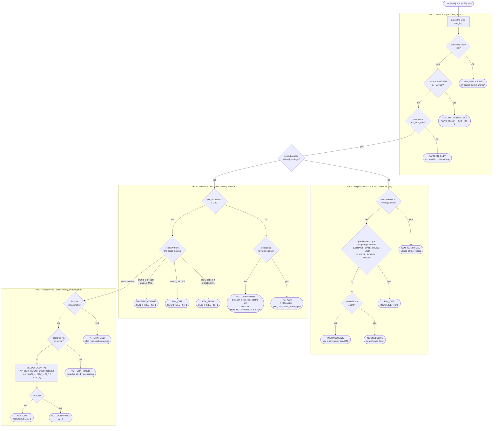

# Reliability Agent Ecosystem

A Python-based BigQuery reliability support system built with Google ADK, FastAPI, and BigQuery metadata analysis. The project reviews recent BigQuery jobs, identifies likely reliability issues, diagnoses them, and produces remediation guidance through a multi-agent workflow.

## Overview

The system is designed to support operational analysis for BigQuery workloads. It evaluates recent jobs, flags candidate incidents, and runs a staged workflow:

1. Detection agent identifies supported issue patterns.
2. Diagnosis agent interprets the evidence and explains the likely impact.
3. Remediation agent recommends next steps or mitigations.
4. Results are stored in BigQuery for downstream review and auditing.

This project is a support-agent framework for BigQuery reliability investigations, with the first production-style detectors focused on query performance and cost-risk patterns.

---

## Supported Incident Types

### 1. Missing Partition Filter

A query is treated as a candidate when it references a time-partitioned BigQuery table and the query does not include a usable filter on the partition column. The detector checks whether the table metadata indicates partitioning and whether the SQL contains a valid partition predicate.

### 2. Slot Contention

A job is treated as a slot contention candidate when it has meaningful slot usage and overlaps in time with other significant BigQuery jobs. This is a heuristic detector intended to flag periods of likely compute contention, not proof of a capacity issue.

### 3. High Cardinality Join

A job is treated as a candidate when the join, rather than the table scan, is the dominant and reducible cost of the query. The detector parses the SQL for joins, reads the job's execution plan from `INFORMATION_SCHEMA.JOBS.job_stages`, and classifies one of four failure modes, because each has a different fix:

| Mode | Evidence | Meaning |
|---|---|---|
| `KEY_SKEW` | slowest worker's compute time over the average; shuffle spilled to disk | one hot key concentrates work onto a single worker |
| `FAN_OUT` | rows out of the join stage over rows in | row multiplication, which may also be inflating downstream aggregates |
| `SHUFFLE_VOLUME` | shuffle bytes over bytes scanned | both sides large and well distributed; the repartition itself is the cost |
| `UNCONSTRAINED_JOIN` | parsed join predicate | cartesian product, or a range predicate that cannot be hash joined |

Because the job has already completed, the evidence is measured rather than estimated. The detector also weights findings by how often the query shape recurs: a one-off query is recorded but not escalated, since its cost cannot be recovered.

`CROSS JOIN UNNEST`, semi and anti joins, and joins on a declared primary key are explicitly not treated as candidates.

#### Decision procedure

The four modes are not four parallel tests. They sit at different depths of one
ordered procedure, and the depth is the point: each gate is cheaper than the one
below it, so the check spends nothing it does not have to. A job exits at the
first gate that can answer.



Three things the ordering encodes.

**Skew is tested before fan-out.** A hot key produces both signals, and skew is
the more specific diagnosis with the more targeted fix.

**The collapsing-key check outranks both the cache-hit check and the dominance
gate.** A key expression that collapses cardinality is a property of the SQL
text: it holds whether or not the query executed, and whatever share of the
cost the join took. Row multiplication inflates downstream aggregates, so it is
a correctness risk rather than only a cost one, and a cost gate must not
discard it. Statement 6 of the validation suite reported this finding for four
consecutive runs and then lost it when its dominance drifted to 0.175 — the
finding was not weaker, it was skipped.

**`m` is the smaller of the two duplication factors.** Rows multiply only when
both sides hold duplicate keys, so one unique side caps the output however
skewed the other is. A dimension lookup scores 1 no matter how hot the fact side
runs. The tier-2 path is reached only when BigQuery fused the join and the
aggregate into one stage, making `records_written` the post-`GROUP BY` count
rather than the join's real output.

#### How the four modes differ in application

|  | `UNCONSTRAINED_JOIN` | `KEY_SKEW` | `SHUFFLE_VOLUME` | `FAN_OUT` |
|---|---|---|---|---|
| Decided at tier | 0 | 1 | 1 | 0, 1 or 2 |
| Needs the execution plan | no | yes | yes | not always |
| Survives a cache hit | yes | no | no | yes, via a collapsing key |
| Subject to the dominance gate | no — exits above it | yes | yes | yes, except the collapsing-key route |
| Confidence reachable | `CONFIRMED` | `CONFIRMED` | `CONFIRMED` | `CONFIRMED`, or `PROBABLE` when inferred |
| Severity | always `HIGH` | `HIGH` when shuffle spilled | `MEDIUM` | `HIGH` at 4x the warn ratio |
| Costs money to find | no | no | no | only on the NDV route |
| Savings currency | slot_ms | elapsed time and reliability | slot_ms | slot_ms, with a measurable fraction |
| Typical fix | supply a join predicate | salt the hot key, or broadcast the small side | pre-aggregate, or filter before joining | deduplicate the build side, or join on a finer key |

Two asymmetries are worth stating plainly.

`UNCONSTRAINED_JOIN` is decided **before** the size and dominance gates. A
cartesian product is wrong at any scale and on any plan, so it is never filtered
out for being small or for sharing cost with a scan — the other three are.

`FAN_OUT` is the only mode with three independent routes to it, because it is
the only one whose evidence survives having no plan. That matters more than it
sounds: cached and repeated queries are exactly the ones worth fixing, and they
are the ones the plan-based modes are blind to.

---

## Architecture

```text
Client / API Request
        |
        v
   FastAPI Router
        |
        v
  run_support_agent()
        |
        v
 review_jobs()
        |
        +------------------------------+
        |                              |
        v                              v
 BigQuery job metadata          Detector logic
   + jobs metadata              - Missing Partition Filter
   + job stages                 - Slot Contention
   + recent jobs                - High Cardinality Join
        |                              |
        +--------------+---------------+
                       |
                       v
             Candidate incidents
                       |
                       v
          Orchestrated ADK workflow
                       |
         +-------------+-------------+
         |                           |
         v                           v
 detection_agent           diagnosis_agent
         |                           |
         +-------------+-------------+
                       |
                       v
               remediation_agent
                       |
                       v
             Store results in BigQuery
```

---

## Project Structure

```text
AgentEcosystem/
├── main.py
├── README.md
├── requirements.txt
├── conftest.py
├── config/
│   ├── settings.py
│   └── join_thresholds.py
├── agents/
│   ├── __init__.py
│   ├── detection_agent/
│   │   ├── agent.py
│   │   └── instructions.md
│   ├── diagnosis_agent/
│   │   ├── agent.py
│   │   └── instructions.md
│   ├── orchestrator_agent/
│   │   └── agent.py
│   └── remediation_agent/
│       ├── agent.py
│       └── instructions.md
├── routers/
│   └── incident_router.py
├── schemas/
│   ├── detection.py
│   ├── diagnosis.py
│   ├── incident.py
│   └── remediation.py
├── services/
│   └── agent_service.py
├── tools/
│   └── bigquery/
│       ├── candidate_detector.py
│       ├── job_stages.py
│       ├── jobs_metadata.py
│       ├── join_detection.py
│       ├── join_review.py
│       ├── partition_detection.py
│       ├── query_recurrence.py
│       ├── query_review.py
│       ├── results_writer.py
│       ├── slot_contention_detector.py
│       ├── table_constraints.py
│       ├── table_metadata.py
│       └── __init__.py
├── tests/
│   ├── test_join_detection.py
│   ├── test_join_parser.py
│   ├── test_join_review.py
│   └── test_partition_detection.py
├── utils/
│   ├── join_parser.py
│   └── sql_parser.py
└── models/
```

---

## Getting Started

### 1. Create a Python environment

```bash
python -m venv .venv
source .venv/bin/activate
```

On Windows PowerShell:

```powershell
python -m venv .venv
.\.venv\Scripts\Activate.ps1
```

### 2. Install dependencies

```bash
pip install -r requirements.txt
```

### 3. Configure environment variables

Create a `.env` file in the project root with values similar to:

```env
GOOGLE_CLOUD_PROJECT="your-project-id"
BQ_LOCATION="US"
MODEL_NAME="gemini-2.0-flash"
LOG_LEVEL="INFO"
BQ_RESULTS_DATASET="bq_support_agent"
BQ_RESULTS_TABLE="incident_results"
GOOGLE_API_KEY="<your-google-api-key>"
JOIN_SCALE_PROFILE="production"
JOIN_PROFILING_ENABLED="false"
```

These settings are used by the app configuration and the BigQuery output writer.

#### Running the join detector against small datasets

The High Cardinality Join thresholds split into scale-free ratios and absolute floors. The floors — 1,000,000 rows and 10 GiB shuffled — exist to suppress joins too small to be worth anyone's time, which means a test dataset clears none of them and the detector reports nothing.

Set `JOIN_SCALE_PROFILE="sandbox"` to relax the floors. The active profile is reported under `join_review.thresholds` in the review response, so an empty result is self-explaining.

Only values that gate **materiality** may differ between profiles. Anything that decides **which failure mode** applies is a ratio and is identical in both, so a finding cannot be classified one way in sandbox and another way in production. Spill was originally a per-profile floor and violated this: at the sandbox value a single spilled byte outranked a measured fan-out and the diagnosis flipped to `KEY_SKEW`. It is now the ratio `spill_ratio_warn`, measured against the shuffle that produced it.

#### Recovering fan-out when the plan hides it

BigQuery usually fuses a join and its partial aggregation into one execution stage. When it does, `records_written` is the post-`GROUP BY` row count rather than the join's real output, so the measured fan-out ratio reads near 1 no matter how badly the join multiplied rows. Every join stage observed in the sandbox workload was fused this way.

The detector reports that honestly: a job whose fan-out could not be measured returns `INCONCLUSIVE` with reason `fanout_unmeasurable_aggregate_fused`, not `PATTERN_ONLY`, because "nothing was demonstrated" and "nothing could be measured" are different claims.

Setting `JOIN_PROFILING_ENABLED="true"` lets the review recover the answer from key cardinality instead. It reads only the join key columns, only for jobs whose fan-out the plan could not measure, and dry-runs each column first so nothing over `profile_max_bytes` (5 GiB) is read. A join on a two-valued column over 20k rows scores 10,000 estimated matches per row; a dimension lookup scores 1 however skewed the fact side is. Findings from this route are capped at `PROBABLE` and carry `evidence_tier: 2`, because an estimate built on uniformity assumptions over approximate distinct counts is not the same grade of evidence as a measurement.

This is the only part of the check that costs money. It is off by default.

### 4. Start the service

```bash
python main.py
```

Or run the app directly with uvicorn:

```bash
uvicorn main:app --reload
```

The app starts on:

```text
http://127.0.0.1:8000
```

---

## API

### Review endpoint

```http
GET /api/review?region=US&lookback_hours=24&jobs_limit=5
```

Parameters:

- `region`: BigQuery region to inspect (default: `US`)
- `lookback_hours`: review window for recent jobs (default: `24`)
- `jobs_limit`: maximum number of jobs to fetch (default: `5`)

### Example response

```json
{
  "success": true,
  "region": "US",
  "lookback_hours": 24,
  "jobs_checked": 3,
  "candidate_count": 2,
  "incidents": [
    {
      "job_id": "bqjob_123",
      "incident_type": "MISSING_PARTITION_FILTER",
      "table_name": "project.dataset.table",
      "detection": {...},
      "diagnosis": {...},
      "remediation": {...}
    }
  ]
}
```

---

## Multi-Agent Workflow

The workflow is orchestrated by the `orchestrator_agent` and runs in sequence:

- `detection_agent`: classifies whether a job qualifies as a supported incident candidate
- `diagnosis_agent`: explains the issue using the evidence gathered from the job and table metadata
- `remediation_agent`: proposes mitigation actions or guidance

The orchestration is defined in `agents/orchestrator_agent/agent.py` and the service layer in `services/agent_service.py`.

---

## Result Storage

When incidents are processed, the system writes a record to the configured BigQuery table. The result payload includes:

- `record_id`
- `issue_reference`
- `agent_response`
- `created_at`

This allows incident history to be inspected in BigQuery for auditing and follow-up.

---

## Current Status and Notes

This repository is an active support-agent implementation with heuristic detection logic for the most common initial reliability issues. It is intended to provide a framework for broader BigQuery incident triage and can be extended with additional detectors and remediation policies.

Current support includes:

- Missing partition filter detection
- Slot contention candidate detection
- High cardinality join detection
- Multi-agent reasoning and result persistence

## Tests

```bash
python -m pytest tests/ -q
```

The suite runs without BigQuery credentials; every BigQuery call is mocked. `tests/test_partition_detection.py` pins the existing partition-filter behaviour so that changes to shared table metadata and job review surface there.

The implementation is best treated as a working beta for investigation and extension rather than as a production-grade guarantee engine.

---

## License

This project is provided as-is for internal or prototype use. Add your license file if you plan to distribute it externally.
